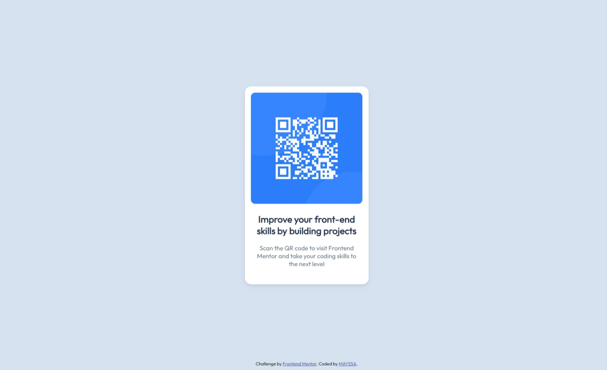

# Frontend Mentor - QR code component solution

This is a solution to the [QR code component challenge on Frontend Mentor](https://www.frontendmentor.io/challenges/qr-code-component-iux_sIO_H). Frontend Mentor challenges help you improve your coding skills by building realistic projects. 

## Table of contents

- [Overview](#overview)
  - [Screenshot](#screenshot)
  - [Links](#links)
- [My process](#my-process)
  - [Built with](#built-with)
- [Author](#author)

## Overview

### Screenshot

### Links

- Solution URL: (https://www.frontendmentor.io/solutions/html-and-css-solution-sR1bH4KlN_)
- Live Site URL: https://may55a.github.io/QR-code-component/

## My process

### Built with

- HTML5
- CSS custom properties
- Flexbox

## Author

- Frontend Mentor - [@MAY55A](https://www.frontendmentor.io/profile/MAY55Ahttps://www.frontendmentor.io/profile/MAY55A)
- LinkedIn - [@Mayssa Ghanmi](https://www.linkedin.com/in/mayssa-ghanmi-a85369276)
